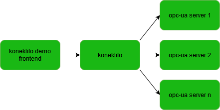

# Konektilo demo frontend
The konektilo demo frontend is an ionic app which you can use for developing a dashboard for your opc-ua servers that are connected to konektilo.
The app is developed with ionic 5.
Below you can see an overview of the different components of konektilo.



# Getting started
* For the ionic setup please take a look at ```https://ionicframework.com/getting-started```
* Clone this repository
* The development server can be started with ```ng serve```
* After startup the development server runs at ```http://localhost:4200```
